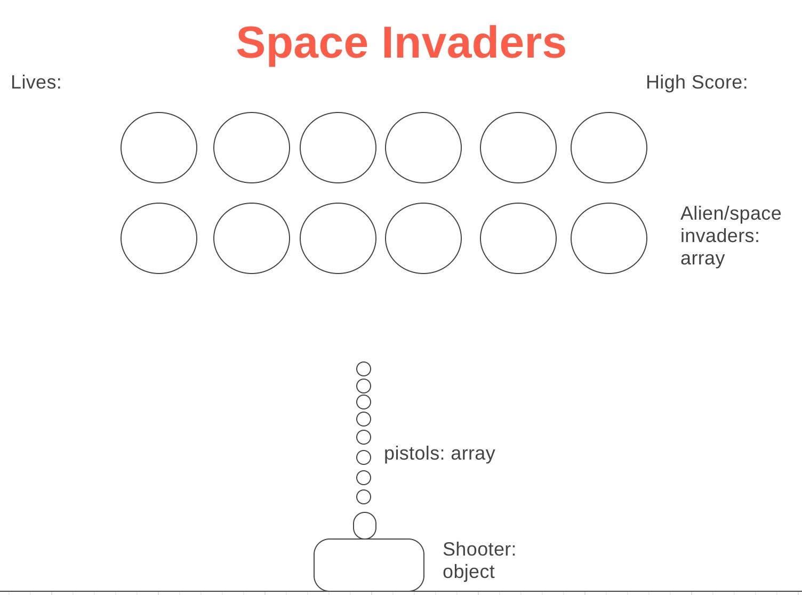

# Space-Invaders
Project 1: Aleena Madni.

## Description

Space Invaders is an arcade video game that was made in 1978 by Tomohiro Nishikado. Space Invaders was one of the first shooting games and it's purpose was to kill waves of aliens with a laser cannon to get the highest points possible. [Wikipedia](https://en.wikipedia.org/wiki/Space_Invaders)

This Game: Super-simple version --> You shoot at them but they dont't shoot back! Guarantee winner majority of the time unless your blind. 

## Two User Personas
1) A 70 year old man who used to love Space Invaders when it came out and stumbled across the game while he was googling nostalgically.
2) A cool hipster dude who loves how the game is so minimalistic and different compared to the games we have now in 2017.

## User Stories for Minimum Viable Product (MVP)
1) As a player, I would want to shoot the space invader.
2) As a player, I would want to defeat a whole row of space invaders.
3) As a player, I would want it to keep score so I know how many points I obtain for killing space invaders.
4) As a player, I would want an alert to know if I beat the round.

## Wireframe

